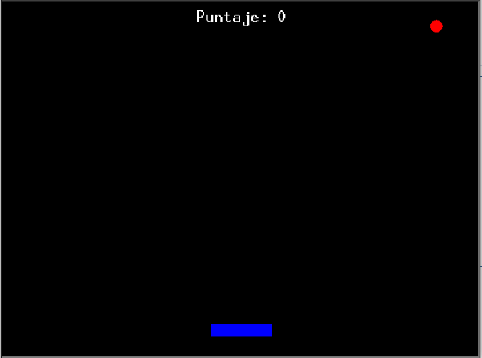
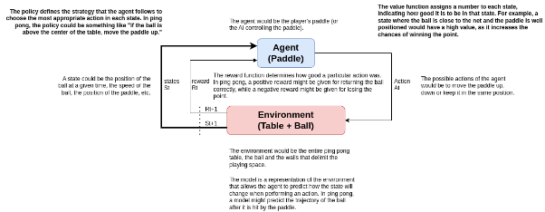
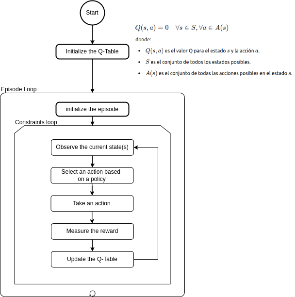
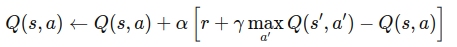

# Fundamentos del Aprendizaje por Refuerzo

El término "Aprendizaje automático por refuerzo", o simplemente "Aprendizaje por refuerzo" (RL, por sus siglas en inglés), se basa en la idea de que un agente aprende a tomar decisiones en un entorno dinámico a través de la adquisición de conocimiento para maximizar la señal de recompensa. Antes de entrar en los detalles, es importante considerar definiciones de los elementos clave del RL [4]:

- **Agente**: la entidad que interactúa con el medio ambiente; es quien toma las decisiones. Puede ser un robot, un coche autónomo, la paleta en el juego de ping pong, etc.
- **Entorno**: el universo en el que interactúa el agente. El medio ambiente es el mundo exterior; comprende todo lo que está fuera del agente. Por ejemplo, puede ser un laberinto, una casa, un parque, el tablero/pelota en el juego de ping pong, etc. No necesariamente tiene que ser un espacio físico.
- **Acción (A)**: conducta que el agente puede realizar, es decir, las posibles acciones que puede tomar en un momento determinado el agente. Lo más frecuente es que se asocie con un movimiento, por ejemplo, hacia el norte, hacia el sur, o recogiendo o dejando caer un objeto, movimiento de subir/bajar de la paleta en el juego de ping pong, etc.
- **Estado (S)**: coyuntura del agente con el entorno, es decir, son los indicadores del ambiente de cómo están los diversos elementos que lo componen en ese momento. Por ejemplo, considere el caso de un robot en una posición en un laberinto determinado, la posición en el tablero tanto de la pelota como la paleta en el juego de ping pong, etc 
- **Recompensa (R)**: retribución (positiva o negativa) que recibe el agente al alcanzar el siguiente estado (s′). Por ejemplo, ganar 10 puntos cuando la paleta golpea la pelota o -10 puntos cuando no lo logra en el juego de ping pong.
- **Política (π)**: estrategia de acción que promueve el cambio de estado en la expectativa de obtener el mejor resultado. En otras palabras, es el objetivo que tienes para la formación, lo que aprenderá el agente. Puede ser, por ejemplo, en el ping pong, la política podría ser algo así como "si la pelota está por encima del centro de la mesa, mover la paleta hacia arriba".
- **Episodio**: conjunto completo de acciones que finaliza al alcanzar una meta. Por ejemplo, ir de un punto a otro, ir de la casa al castillo, etc. Pensando que cada movimiento es un paso único, el conjunto de pasos hasta el estado final es lo que se considera un episodio.
## Criterios de selección de los algoritmos de RL
La selección de algoritmos de RL depende de varias condiciones y características del problema que se intenta resolver. Aquí hay algunas condiciones clave que definen esta selección:
### **Naturaleza del Entorno**
- **Estático vs Dinámico:** Si el entorno cambia con el tiempo, pueden ser necesarios algoritmos que se adapten rápidamente a estos cambios.
- **Determinístico vs Estocástico:** En entornos determinísticos, la misma acción en el mismo estado siempre produce el mismo resultado, mientras que en entornos estocásticos, el resultado puede variar. Por ejemplo, algoritmos como Q-learning funcionan bien en ambos tipos de entornos, pero en entornos altamente estocásticos, pueden ser necesarios algoritmos que manejan mejor la incertidumbre, como los basados en métodos Monte Carlo.
### **Disponibilidad de Información**
- **Modelo vs Sin Modelo:** Si se conoce un modelo del entorno (transiciones y recompensas), se pueden utilizar métodos como Value Iteration o Policy Iteration. En ausencia de un modelo, se recurren a métodos como Q-learning y SARSA.
- **Grado de Exploración:** Algoritmos como Epsilon-Greedy o Upper Confidence Bound (UCB) se utilizan para balancear la exploración y explotación.
### **Dimensionalidad del Problema**
- **Espacio de Estados y Acciones:** Problemas con grandes espacios de estados y acciones pueden necesitar técnicas de aproximación de funciones, como Deep Q-Learning (DQN) que usa redes neuronales.
### **Especificaciones del Objetivo**
- **Recompensas Inmediatas vs Futuras:** Algoritmos como Temporal Difference (TD) y Q-learning son útiles para maximizar recompensas a largo plazo.
- **Optimización de Políticas:** Si el objetivo es optimizar una política, se pueden usar métodos basados en políticas como Policy Gradient Methods.
### **Capacidades Computacionales**
- **Requerimientos de Tiempo y Memoria:** Algoritmos como Q-learning pueden ser computacionalmente intensivos en problemas grandes. Métodos basados en aprendizaje profundo, como DQN, requieren más recursos computacionales.
### **Tipo de Interacción con el Entorno**
- **Episódico vs Continuo:** En problemas episódicos, el agente trabaja en secuencias de interacciones que terminan en un estado terminal. En problemas continuos, no hay un estado terminal definido.
### **Disponibilidad de Datos de Entrenamiento**
- **Aprendizaje en Línea vs Offline:** En el aprendizaje en línea, el agente aprende a medida que interactúa con el entorno. En el aprendizaje offline, el agente aprende de un conjunto de datos preexistente.
### **Robustez y Seguridad**
- **Entornos Críticos:** En aplicaciones críticas (como conducción autónoma), se necesitan algoritmos que sean robustos a errores y que puedan manejar fallas de manera segura.
### **Interacción con Otros Agentes**
- **Multiagente:** En entornos donde múltiples agentes interactúan, se requieren algoritmos que manejan la cooperación y competencia entre agentes, como los basados en aprendizaje multiagente.

Seleccionar el algoritmo adecuado implica evaluar estas condiciones y elegir el que mejor se adapte a las características específicas del problema y las restricciones del entorno.
# Casos de estudio
## Juego de Ping Pong
### Descripción del juego

Imagina un emocionante juego de ping pong donde tú, como único jugador, controlas una pala situada en un lado de la pantalla. Tienes tres (3) vidas al comenzar, y tu objetivo es devolver la pelota tantas veces como sea posible para mantener el juego en marcha. Cada vez que logras devolver la pelota, te mantienes en el juego. Sin embargo, si la pelota pasa de largo y no logras devolverla, pierdes una vida. Si te quedas sin vida, el juego termina inmediatamente. Por cada pelota devuelta con éxito, no solo mantienes tus vidas, sino que obtienes 10 puntos. Pero cuidado, si pierdes la pelota y con ello una vida, se te restará 10 puntos de tu marcador. El desafío está en jugar hasta que se cumplan 3000 interacciones o hasta que logres acumular 1000 puntos, lo que ocurra primero. A medida que el juego avanza, la presión aumenta, y cada rebote exitoso te acerca más a la victoria.

### Relación del juego de ping pong y los elementos claves de RL
El juego de ping pong para un solo jugador, puede ser una excelente representación para explicar los conceptos clave del aprendizaje por refuerzo (Reinforcement Learning, RL). A continuación, se describen los elementos clave de RL en el contexto de este juego:

||**Definición**|**Ejemplo**|
| :- | :-: | :-: |
|Acciones (Actions) **(A)**|Las acciones son las decisiones o movimientos que un agente puede realizar en un entorno dado.|El jugador puede tomar dos acciones: mover la pala hacia arriba o hacia abajo. Estas acciones impactan directamente en la posición del jugador y, por lo tanto, en la capacidad de devolver la pelota.|
|Política (Policy)**(π)**|La política es la estrategia o regla que el agente sigue para decidir qué acción tomar en un estado dado.|Una política simple podría ser: "Si la pelota está por encima de la pala, mueve la pala hacia arriba; si está por debajo, mueve la pala hacia abajo". En términos de RL, una política determina cómo el jugador actúa en función de la posición actual de la pelota.|
|Función de Valor (Value Function)**(Q)**|La función de valor estima la utilidad a largo plazo de un estado, es decir, el valor esperado del retorno futuro que puede recibir el agente desde un estado particular.|El valor de un estado podría representar la probabilidad de que la pelota sea devuelta exitosamente y se mantenga en juego durante más tiempo, dado que el jugador actúa óptimamente desde esa posición.Por ejemplo, si la pelota está cerca del borde superior de la pantalla, el estado podría tener un valor más bajo porque es más difícil devolver la pelota en esa posición.|
|Función de Recompensa (Reward Function):**( R )**|La función de recompensa proporciona feedback inmediato sobre la bondad de una acción en un estado dado, generalmente en forma de una señal numérica.|Una recompensa positiva se podría otorgar cada vez que el jugador devuelve la pelota con éxito (por ejemplo, +1 por cada rebote exitoso).Una recompensa negativa podría ser otorgada si la pelota pasa más allá de la pala y el jugador pierde (-1 por perder).La recompensa guía al agente (jugador) a maximizar la cantidad de rebotes y, por lo tanto, mejorar su estrategia de juego.|
|Modelo **(Model)**:|Un modelo en RL predice cómo se va a comportar el entorno en respuesta a las acciones del agente, es decir, predice las transiciones entre estados y las recompensas asociadas.| El modelo podría predecir cómo cambiará la posición de la pelota después de que el jugador mueva la pala hacia arriba o hacia abajo. Aunque en un entorno RL puro, el agente aprendería estas transiciones a través de la interacción, en este juego se asume que las reglas físicas de la pelota son conocidas (como la reflexión de la pelota en los bordes o la colisión con la pala).|

En un contexto de aprendizaje por refuerzo, un agente (en este caso, el jugador) aprendería a jugar al ping pong optimizando una política que maximiza las recompensas acumuladas (por ejemplo, mantener la pelota en juego durante el mayor tiempo posible) al tomar acciones (mover la pala) basadas en la función de valor que evalúa la probabilidad de éxito futuro desde un estado dado. El modelo puede estar implícito en el entorno, prediciendo cómo la pelota reacciona a las acciones del jugador. Este marco de RL podría aplicarse para desarrollar un agente autónomo capaz de jugar al ping pong aprendiendo a través de la experiencia, sin necesidad de reglas predefinidas.

### Naturaleza del juego de ping pong
En el contexto del aprendizaje por refuerzo, la **naturaleza del entorno** en el juego de ping pong puede describirse en términos de los siguientes aspectos:
#### Determinístico vs. Estocástico:
- **Determinístico**: El entorno en este juego de ping pong es predominantemente determinístico, lo que significa que las acciones del jugador (mover la pala hacia arriba o hacia abajo) producen resultados predecibles. Por ejemplo, si el jugador mueve la pala hacia arriba, la pala se mueve exactamente a la posición prevista, y la trayectoria de la pelota sigue leyes físicas predefinidas.
- **Estocástico**: En un entorno más complejo o en un simulador que incluye variabilidad, factores como pequeños desvíos en la física de la pelota o errores en la detección de colisiones podrían introducir un elemento de aleatoriedad, haciendo que el entorno sea estocástico. Sin embargo, en este juego básico, la estocasticidad es mínima.
#### Estacionario vs. No Estacionario:
- **Estacionario**: El entorno es mayormente estacionario, lo que significa que las reglas del juego (como la gravedad, las colisiones, la velocidad de la pelota) no cambian con el tiempo. La relación entre las acciones y las recompensas sigue siendo constante.
- **No Estacionario**: Si las reglas del juego cambian con el tiempo (por ejemplo, si la velocidad de la pelota aumenta gradualmente para hacer el juego más desafiante), el entorno se volvería no estacionario. En el juego básico que hemos implementado, el entorno se mantiene estacionario.
#### Discreto vs. Continuo:
- **Continuo**: El entorno es continuo en cuanto a las posiciones posibles de la pala y la pelota. Tanto la pala como la pelota pueden ocupar una gama continua de posiciones a lo largo de los ejes X e Y.
- **Discreto**: Si el juego fuera simplificado a una rejilla o si se establecieran posiciones específicas donde la pala y la pelota pueden estar, entonces el entorno sería discreto. Sin embargo, en la implementación estándar, las posiciones y movimientos son continuos.
#### Totalmente Observable vs. Parcialmente Observable:
- **Totalmente Observable**: El entorno es totalmente observable, lo que significa que el jugador (o un agente en un escenario de aprendizaje por refuerzo) tiene acceso completo a toda la información relevante para tomar decisiones óptimas. El jugador puede ver la posición de la pelota y la pala en todo momento.
- **Parcialmente Observable**: Si el entorno limitara la información disponible (por ejemplo, si la vista del jugador estuviera restringida o si se introdujeran elementos ocultos), sería parcialmente observable. Sin embargo, en el juego de ping pong básico, no hay tal restricción.
#### Episódico vs. Continuo:
- **Episódico**: En un entorno episódico, las interacciones del agente con el entorno se dividen en episodios separados, donde cada episodio tiene un inicio y un fin claro. El juego de ping pong puede considerarse episódico si cada partida (desde que comienza el juego hasta que el jugador pierde) se trata como un episodio.
- **Continuo**: Si el juego nunca terminara y el agente continuara jugando indefinidamente sin reiniciar, el entorno sería continuo. Aunque cada partida puede reiniciarse después de perder, en la implementación básica, el juego tiene episodios claros.
#### Multiagente vs. Monoagente:
- **Monoagente**: El entorno es monoagente, ya que solo hay un jugador interactuando con el entorno. No hay otros jugadores o agentes con los que el jugador deba competir o cooperar.
- **Multiagente**: Si hubiera más jugadores (por ejemplo, un oponente controlado por IA), el entorno se volvería multiagente. En el caso actual, el entorno se mantiene monoagente.

La naturaleza del entorno en el juego de ping pong, desde la perspectiva del aprendizaje por refuerzo, se puede describir como **determinístico**, **estacionario**, **discreto**, **totalmente observable**, **episódico** y **monoagente**. Estas características simplifican el proceso de aprendizaje, permitiendo que un agente potencial (o jugador) pueda aprender a interactuar de manera óptima con el entorno sin la complejidad añadida de incertidumbre o falta de información.
### Algoritmos de RL recomendados

Dado que la naturaleza del juego de ping pong que has descrito es **determinístico**, **estacionario**, **discreto**, **totalmente observable**, **episódico** y **monoagente**, los algoritmos de aprendizaje por refuerzo recomendados para este entorno incluyen:
#### Q-Learning:
- **Descripción**: Q-Learning es un algoritmo basado en la tabla Q que busca aprender la función de valor de acción (Q-function) para un agente en un entorno. Se trata de un método off-policy, lo que significa que el agente puede aprender la política óptima independientemente de la política que sigue para explorar el entorno.
- **Aplicabilidad**: Dado que el entorno es discreto y totalmente observable, Q-Learning puede ser muy eficaz. Se construye una tabla Q para mapear estados y acciones a valores Q, y el agente aprende a maximizar la recompensa acumulada.
- **Ventajas**: Es fácil de implementar y converge hacia la política óptima con suficiente exploración.
#### SARSA (State-Action-Reward-State-Action):
- **Descripción**: SARSA es un algoritmo similar a Q-Learning, pero es un método on-policy, lo que significa que el agente actualiza la tabla Q usando la política que está siguiendo actualmente.
- **Aplicabilidad**: En un entorno discreto y episódico, SARSA es útil porque considera la secuencia completa de acciones que el agente realmente toma, lo que puede ser más seguro en ciertos escenarios donde se desea evitar comportamientos exploratorios riesgosos.
- **Ventajas**: Proporciona una política más conservadora y puede ser más estable en algunos entornos.
#### Dynamic Programming (DP) Methods:
- **Descripción**: Métodos como Iteración de Políticas e Iteración de Valores son algoritmos de programación dinámica que se pueden usar si el modelo del entorno es conocido. Estos métodos iteran sobre la función de valor o la política hasta que convergen en la solución óptima.
- **Aplicabilidad**: Como el entorno es estacionario, determinístico y totalmente observable, los métodos de programación dinámica pueden calcular eficientemente la política óptima.
- **Ventajas**: Ofrecen soluciones exactas y son eficientes en entornos discretos y conocidos.
#### Monte Carlo Methods:
- **Descripción**: Los métodos de Monte Carlo se basan en simular muchos episodios completos y promediar los resultados para estimar los valores de estado o de acción. Pueden ser utilizados en entornos donde no se conoce el modelo y es necesario aprender a partir de la experiencia directa.
- **Aplicabilidad**: Como el entorno es episódico, los métodos de Monte Carlo pueden ser efectivos para evaluar y mejorar políticas basándose en el retorno observado en episodios completos.
- **Ventajas**: No requieren un modelo del entorno y son efectivos en entornos episódicos.
#### Dyna-Q:
- **Descripción**: Dyna-Q combina aspectos de Q-Learning con la planificación. Se construye un modelo del entorno basado en la experiencia y se utiliza para simular y actualizar la tabla Q adicionalmente a la experiencia directa.
- **Aplicabilidad**: En un entorno determinista y discreto, Dyna-Q puede aprovechar tanto la experiencia real como las simulaciones del modelo aprendido para acelerar el proceso de aprendizaje.
- **Ventajas**: Combina aprendizaje directo y simulaciones para mejorar la eficiencia de la convergencia.

Para un entorno con las características descritas, **Q-Learning** y **SARSA** son probablemente los algoritmos más recomendados debido a su capacidad para manejar entornos discretos, determinísticos y totalmente observables. **Dynamic Programming** es también una opción sólida si el modelo del entorno es conocido. Si estás trabajando con simulaciones o si el entorno es sencillo, los **métodos de Monte Carlo** pueden ser útiles. **Dyna-Q** es ideal si buscas una combinación de aprendizaje basado en experiencia directa y simulaciones.
### Implementar Q-Learning en un Juego de Ping Pong

#### Paso 1: Definir el Entorno y los Estados
Primero, necesitamos definir el entorno en el que el agente (nuestro jugador) operará. En Q-Learning, el entorno se representa en términos de **estados**.

**Estados**: Un estado es una representación del entorno en un momento dado. En el juego de ping pong, un estado podría estar compuesto por:

1. Caso 1
   1. La posición vertical/horizontal de la pala del jugador.
   1. La posición vertical y horizontal de la pelota.
1. Caso 2
   1. La posición vertical/horizontal de la pala del jugador.
   1. La posición vertical de la pelota.
   1. La dirección del movimiento de la pelota (arriba o abajo).
#### Paso 2: Definir las Acciones
Las **acciones** son los movimientos que el agente puede realizar en cada estado.
**Acciones**: En este caso, las acciones disponibles para el agente podrían ser:
1. Caso 1
   1. Mover la pala hacia arriba.
   1. Mover la pala hacia abajo.
   1. Mantener la pala en la misma posición.
1. Caso 2
   1. Mover la pala hacia arriba.
   1. Mover la pala hacia abajo.
#### Paso 3: Inicializar la Tabla Q
La tabla Q es una estructura que almacena los valores Q para cada par estado-acción. Estos valores representan la "calidad" de tomar una acción en un estado particular en términos de la recompensa esperada a largo plazo.

**Tabla Q**: Inicializa la tabla Q con valores pequeños (por ejemplo, todos ceros). La tabla Q tendrá filas para cada estado posible y columnas para cada acción posible.
#### Paso 4: Definir la Función de Recompensa
La **función de recompensa** es lo que el agente intenta maximizar. El objetivo del agente es maximizar la suma de estas recompensas a lo largo del juego. Necesitamos definir las recompensas para diferentes resultados.
**Recompensas**:
1. Si el jugador devuelve la pelota con éxito (la pelota rebota en la pala), se le otorga una recompensa positiva (por ejemplo, +10 puntos).
1. Si el jugador falla y la pelota pasa de largo, se le otorga una recompensa negativa (por ejemplo, -10 puntos).
1. En caso que no ocurra ninguna de las situaciones previas se otorga 0 puntos.
#### Paso 5: Implementar el Algoritmo Q-Learning
Ahora, implementamos el núcleo del algoritmo Q-Learning.
**Algoritmo Q-Learning**:
1. **Exploración vs. Explotación**: Define un parámetro ε (epsilon) para decidir si el agente explora acciones nuevas o explota la mejor acción conocida hasta el momento. Con probabilidad ε, el agente elegirá una acción al azar (exploración); de lo contrario, elegirá la acción con el mayor valor Q en ese estado (explotación).
1. **Actualización de la Tabla Q**: Después de que el agente tome una acción y observe la recompensa y el nuevo estado resultante, actualizamos la tabla Q usando la fórmula:

   

   Donde:
   1. Q(s,a) es el valor Q para el estado actual s y la acción a.
   1. α es la tasa de aprendizaje (learning rate).
   1. r es la recompensa obtenida después de tomar la acción a.
   1. γ es el factor de descuento, que determina la importancia de las recompensas futuras.
   1. es el valor Q máximo para el siguiente estado s′ y todas las acciones posibles a′.

#### Paso 6: Entrenamiento y Evaluación
Finalmente, entrenamos al agente durante varios episodios y evaluamos su rendimiento.

6. **Entrenamiento**: Repite el proceso de Q-Learning durante muchos episodios (partidas del juego). A medida que el agente experimenta más, la tabla Q se ajusta para reflejar las mejores acciones a tomar en diferentes situaciones.
6. **Evaluación**: Después del entrenamiento, evalúa el agente usando la política aprendida (es decir, seleccionando siempre la acción con el mayor valor Q). Mide su rendimiento para ver si está jugando de manera óptima, maximizando el puntaje y minimizando las pérdidas de vidas.

Q-Learning es un proceso iterativo donde el agente mejora su política de acción con el tiempo mediante la actualización continua de la tabla Q. En el juego de ping pong, el agente aprenderá a mover la pala de manera efectiva para maximizar su puntaje y minimizar la pérdida de vidas, mejorando su rendimiento en cada episodio de juego. **En resumen,** el ping pong es un excelente ejemplo para entender cómo funciona el aprendizaje por refuerzo. Al descomponer el juego en sus componentes básicos, podemos apreciar cómo los agentes aprenden a tomar decisiones óptimas a través de la interacción con su entorno y la obtención de recompensas.

## Herramientas utiles
- Convertir WORD a Markdown Online [Aspose](https://products.aspose.app/words/conversion/word-to-md)

## Bibliografía

- [1] Y. -C. Choi and H. -S. Ahn, "A survey on multi-agent reinforcement learning: Coordination problems," *Proceedings of 2010 IEEE/ASME International Conference on Mechatronic and Embedded Systems and Applications*, QingDao, China, 2010, pp. 81-86
- [2] Rana, A.S., Iqbal, F., Siddiqui, A.S. and Thomas, M.S. (2019), Hybrid methodology to analyse reliability and techno-economic evaluation of microgrid configurations. IET Gener. Transm. Distrib., 13: 4778-4787.
- [3] Sutton, Richard S., and Andrew G. Barto. *Reinforcement Learning: An Introduction*. MIT Press, 2018. 
- [4] Ris-Ala, R. (2023). *Fundamentals of Reinforcement Learning*. Springer Nature Switzerland.